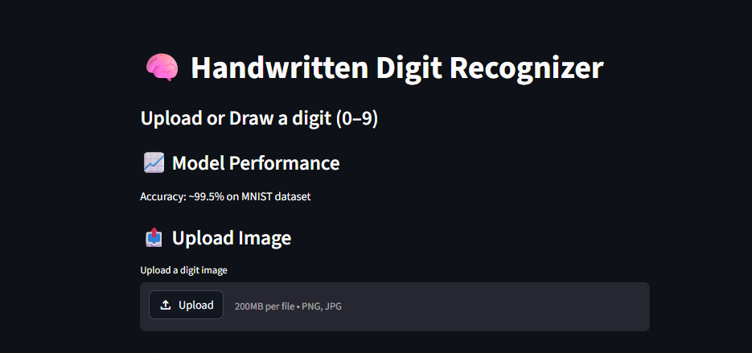
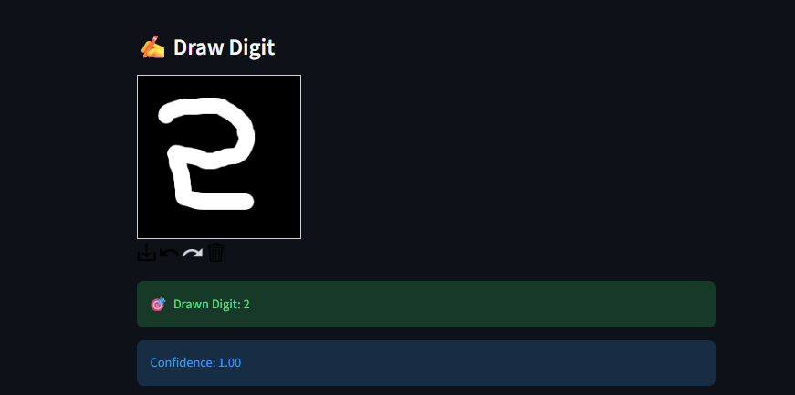
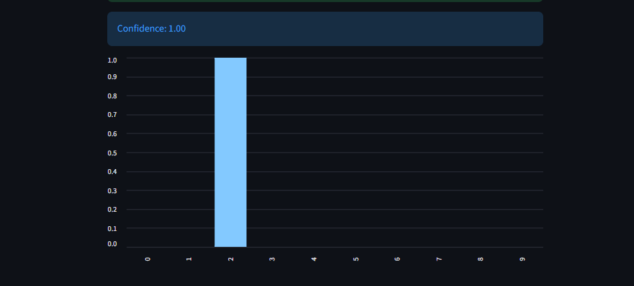

# 🧠 Handwritten Digit Recognizer  
### 🎓 CodeC Technologies Internship – Task 1  

---

## 📌 Project Description  

The **Handwritten Digit Recognizer** is a deep learning-based web application developed as part of **Task 1 of the CodeC Technologies Internship**.  

This project uses a **Convolutional Neural Network (CNN)** trained on the MNIST dataset to recognize handwritten digits (0–9).  

Users can:
- Upload an image of a digit  
- Draw a digit on the screen  

The system predicts the digit along with a confidence score in real time.

---

## 🎯 Objectives  

- Understand and implement CNN models  
- Perform image preprocessing  
- Build an interactive web app using Streamlit  
- Deploy machine learning models  

---

## ⚙️ Technologies Used  

- Python  
- TensorFlow / Keras  
- Streamlit  
- NumPy  
- OpenCV  
- Pillow  

---

## 🧠 Model Details  

- Model: Convolutional Neural Network (CNN)  
- Dataset: MNIST  
- Input Size: 28 × 28 grayscale image  
- Output: Digit (0–9)  
- Accuracy: ~99.5%  

---

## 🔄 Working Process  

1. User uploads or draws a digit  
2. Image is converted to grayscale  
3. Image is resized to 28×28  
4. Pixel values are normalized  
5. CNN model predicts the digit  
6. Output with confidence score is displayed  

---

## ✨ Features  

- 📤 Upload image feature  
- ✍️ Draw digit canvas  
- 🎯 Real-time prediction  
- 📊 Confidence score & graph  
- 🎨 Clean UI  
- ⚡ High accuracy  

---

## 🖼️ Screenshots  

### 📤 Upload Interface  


### ✍️ Draw Digit  


### 🎯 Prediction Output  


---
## ⚙️ Installation & Setup  

### 1. Clone Repository  
```bash
git clone https://github.com/your-username/digit-recognizer.git
cd digit-recognizer
